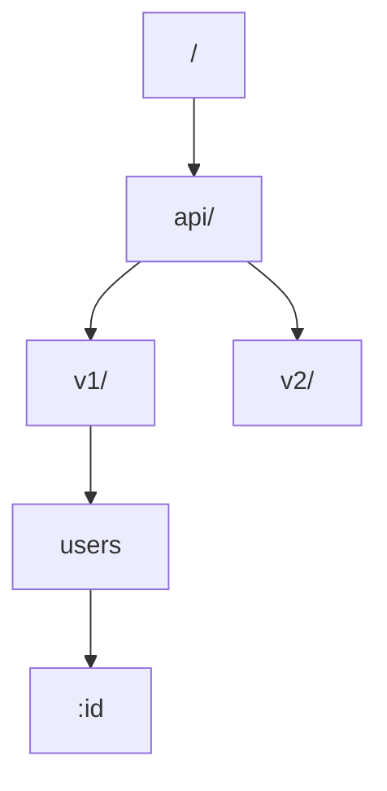
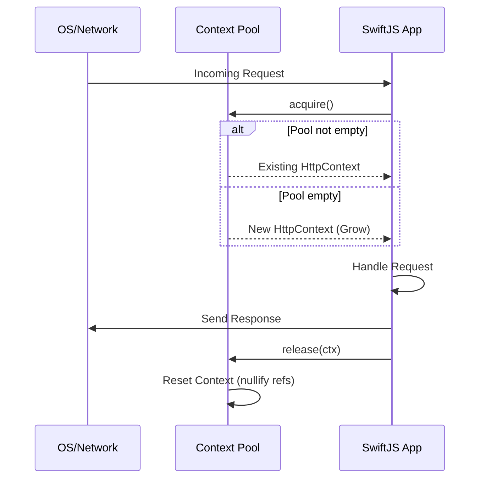
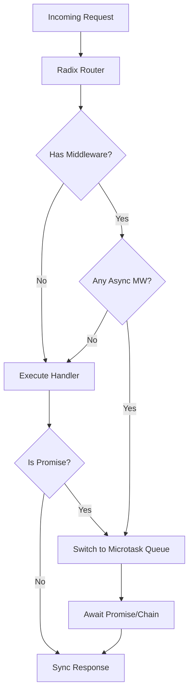
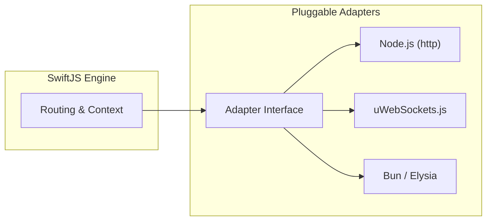

# Internal Workings & Optimizations

SwiftJS is designed from the ground up for maximum throughput and minimal overhead. This document explains the core algorithms and architectural decisions that make SwiftJS faster than traditional frameworks.

## 1. Zero-Allocation Radix Router

Traditional routers often split path strings into arrays or use expensive regular expressions for every request. SwiftJS uses a high-performance **Radix Tree (Prefix Tree)** implementation.

### Key Optimizations:
- **Zero-Allocation Matching**: The router avoids string splitting (`split('/')`) during the match phase. It traverses the path string character by character using indices.
- **Static Route Fast-Path**: Routes without parameters are stored in a `Map` for constant-time `O(1)` lookups.
- **Reusable Match Object**: Instead of creating a new object for every match, the router uses a pre-allocated `reusableMatch` object, significantly reducing Garbage Collection (GC) pressure.



## 2. Context Pooling

In a typical Node.js framework, a new "Context" or "Request/Response" wrapper is created for every single HTTP request. For an application handling 50k requests per second, this creates millions of short-lived objects that choke the GC.

SwiftJS implements **Context Pooling**:
- **Reuse**: When a request starts, a `HttpContext` is acquired from a pre-allocated pool.
- **Reset**: After the response is sent, the context is cleared (references set to `null`) and returned to the pool.
- **Impact**: This reduces GC cycles by up to 80% in high-concurrency scenarios.



### Technical Deep Dive:
The pool has a default capacity of **1024 contexts**. If the pool is exhausted during a massive burst, SwiftJS will fall back to creating temporary objects, which are then discarded rather than returned to the pool once it's full. This prevents the pool from growing indefinitely and consuming too much memory.

## 3. Hybrid Sync/Async Execution

Most modern frameworks are "all-in" on `async/await`. While convenient, creating a `Promise` for every single middleware and handler adds overhead.

SwiftJS uses a **Sync-First** execution model:
- **Fast Path**: If a route has no middleware and the handler returns a plain object (not a Promise), SwiftJS executes it synchronously and sends the response immediately.
- **Dynamic Transition**: SwiftJS only switches to the asynchronous microtask queue if a middleware calls `next()` or a handler returns a `Promise`.



### Event Loop Optimization:
By avoiding `Promise` creation on the fast path, SwiftJS stays on the current event loop tick. This results in sub-millisecond response times for simple API endpoints, as there is no overhead from the V8 promise scheduler.

| Feature | SwiftJS | Traditional Frameworks |
| :--- | :--- | :--- |
| **Execution** | Sync-First (Hybrid) | Full Async Middleware Chain |
| **GC Pressure**| Low (Pooling) | High (Object per request) |
| **Routing** | character-indexed Radix | String splitting / Regex |

## 4. Optimized Middleware Composition

Middleware in SwiftJS is composed using a technique similar to `koa-compose`, but optimized for the common case of small chains (1-3 middlewares).

- **Hardcoded Fast-Paths**: For 1, 2, or 3 middlewares, SwiftJS uses hardcoded functions to avoid the overhead of the recursive `dispatch` function.
- **Reduced Call Stack**: By unrolling small chains, we reduce the depth of the JavaScript call stack.

```typescript
// Example of a 2-middleware fast-path optimization
if (len === 2) {
  const m0 = middlewares[0];
  const m1 = middlewares[1];
  return (ctx, next) => m0(ctx, () => m1(ctx, next));
}
```

## 5. Runtime Adapters

SwiftJS treats the runtime as a pluggable component. While it provides a standard Node.js adapter, it also includes a **uWebSockets.js (uWS)** adapter.

- **uWS Adapter**: Bypasses the Node.js `http` module and its native HTTP parser entirely. It talks directly to the C++ bindings of uWebSockets, pushing performance toward **100k+ req/sec**.
- **Bun/Edge Adapters**: Optimized for the specific APIs of those environments (e.g., `Bun.serve`).


