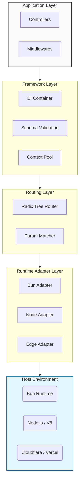
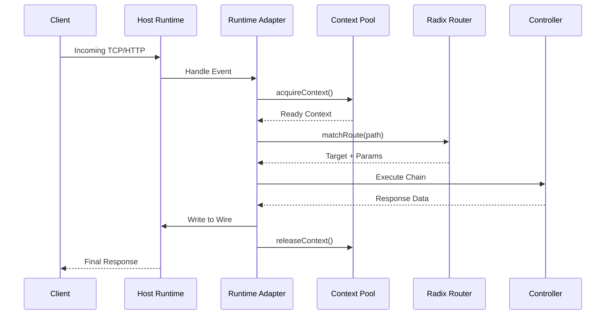

# Philosophy & Architecture

SwiftJS is meticulously engineered with a **Performance-First** philosophy. Every layer of the framework—from the low-level runtime adapters to the developer-facing controllers—is designed to minimize overhead and maximize throughput.

## Design Principles

1. **Zero-Allocation Hot Paths**: Crucial operations like routing and parameter parsing avoid object creation wherever possible to prevent Garbage Collection (GC) pauses.
2. **Iterative Runner**: The middleware chain is executed using a high-performance iterative loop rather than recursive closures, preserving the call stack and improving cache locality.
3. **Runtime Agnostic Core**: A pluggable adapter system allows the core engine to run with native performance on **Bun**, **Node.js**, and **Edge Runtime**.
4. **Hardware Affinity**: Optimizations tailored for modern CPU architectures, including branch prediction hints and memory alignment.

## Internal Architecture

SwiftJS utilizes a strictly layered architecture. This separation of concerns ensures that low-level optimizations are decoupled from application logic.

### The Radix Engine
The core of SwiftJS is our high-performance **Radix Tree Router**. Unlike standard regex-based routers which suffer from O(n) complexity, our Radix Tree provides O(k) lookup (where k is the path length).
- **Branch Optimization**: Static routes are pre-indexed for near $O(1)$ fast-path lookup.
- **Stack-based Traversal**: We avoid recursive calls during tree traversal, using a small, reusable stack to manage parametric matching.

### Context Pooling
To handle tens of thousands of requests per second, SwiftJS employs a **Global Context Pool (GCP)**. 
- **The Problem**: Creating a new `Context` object for every request triggers massive GC overhead.
- **The Solution**: We pre-allocate a pool of `HttpContext` objects. When a request arrives, we "acquire" a context, reset its state, and "release" it back to the pool once the response is sent.

## Request Lifecycle

The lifecycle of a request in SwiftJS is highly optimized to ensure the shortest possible path to the handler.

### 1. Zero-Alloc Routing
The router doesn't create new objects or arrays for parameters during the match. Instead, it populates existing pre-allocated buffers in the `Context`.

### 2. Lifecycles & Dependency Injection
The built-in DI container manages service lifecycles with precision:
- **Singleton**: Persistent state shared across all requests.
- **Transient**: Scoped to a specific call.
- **Request**: Automatically initialized when a request hits the handler and purged during `releaseContext()`.

### 3. Response Serialization
SwiftJS uses a high-performance serializer that can skip unnecessary stringifications for common types, writing buffers directly to the runtime stream for maximum throughput.

