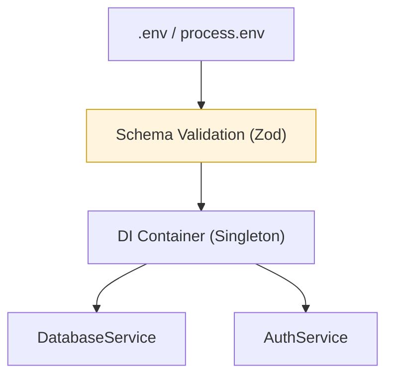

# Configuration & Environment

SwiftJS provides a production-grade configuration system designed for security, type-safety, and performance.

## The "Fail-Fast" Principle

A core tenet of the SwiftJS philosophy is **Validation at Boot**.
- **The Problem**: Applications that crash 10 minutes after deploy because of a missing API key are unreliable.
- **The Solution**: We strongly recommend using Zod to validate your entire configuration schema during the application's initialization. If a secret is missing, the process should exit immediately with a clear error.

## Architecture: Config via DI

For maximum performance and clean architecture, configuration should be injected into your services via the **Dependency Injection (DI) Container**.



### Why use DI for config?
1. **Zero-Overhead Access**: Accessing a singleton from the DI container is highly optimized and avoids repeated `process.env` lookups, which can be surprisingly slow in tight loops.
2. **Easy Testing**: You can easily swap production config for test mockups during unit tests.
3. **Type-Safety**: Your entire application benefits from full Intellisense based on your validated schema.


## Centralized Config Pattern

We recommend creating a `src/config/index.ts` file to centralize and validate your configuration.

```typescript
import { z } from 'zod';

const ConfigSchema = z.object({
  port: z.string().transform(Number).default('3000'),
  dbUrl: z.string().url(),
  env: z.enum(['development', 'production', 'test']).default('development')
});

export const config = ConfigSchema.parse({
  port: process.env.PORT,
  dbUrl: process.env.DATABASE_URL,
  env: process.env.NODE_ENV
});
```

## Using Config via Dependency Injection

The best way to access config throughout your app is to register it in the DI container.

```typescript
app.container.register('config', () => config, { scope: 'singleton' });

// Usage in a service
class S3Service {
  constructor(private config: typeof config) {
    this.client = new S3(config.s3Options);
  }
}
```

## Configuration Reference

The `createApp()` factory function (and the `Swift` class) accepts a configuration object that implements the `SwiftConfig` interface.

### General Settings

| Key | Type | Default | Description |
| :--- | :--- | :--- | :--- |
| `port` | `number` | `3000` | Port for the server to listen on. |
| `host` | `string` | `'0.0.0.0'` | Host address to bind the server to. |
| `env` | `'development' \| 'production' \| 'test'` | `'development'` | The application environment. |
| `runtime` | `'auto' \| 'node' \| 'bun'` | `'auto'` | Target runtime. Auto-detects by default. |
| `routesDir` | `string` | `'./routes'` | Directory for file-based route discovery. |
| `logLevel` | `'debug' \| 'info' \| 'warn' \| 'error'` | `'info'` | Logging level for the built-in pino logger. |
| `trustProxy` | `boolean` | `false` | Enable if running behind a reverse proxy (trusts `X-Forwarded-*` headers). |
| `bodyLimit` | `number` | `1048576` (1MB) | Maximum size of request body in bytes. |

### Cache Options

Configuration for the built-in caching system.

```typescript
{
  cache: {
    driver: 'memory' | 'redis',
    ttl: number, // Time-to-live in seconds
    max: number, // Max items for memory cache
    redis: { url: string } // Redis URL for redis driver
  }
}
```

### CORS Options

Configuration for Cross-Origin Resource Sharing.

```typescript
{
  cors: {
    origin: string | string[] | boolean,
    methods: string[],
    allowedHeaders: string[],
    exposedHeaders: string[],
    credentials: boolean,
    maxAge: number
  }
}
```

### Rate Limiting

Global rate limiting configuration.

```typescript
{
  rateLimit: {
    max: number, // Max requests
    window: number // Window in seconds
  }
}
```

### Documentation Settings

Customize the auto-generated OpenAPI/Swagger documentation.

```typescript
{
  documentation: {
    title: string,
    version: string,
    description: string,
    securitySchemes: object,
    security: array
  }
}
```

## Secrets Management

For sensitive production secrets, we recommend:
1. **GitHub Secrets**: For CI/CD injection.
2. **AWS Secrets Manager / HashiCorp Vault**: For enterprise-grade secret rotation.
3. **SOPS**: For encrypted `.env` files committed to Git.

## Best Practices

1. **Validate at Start**: Use Zod to validate your config immediately. It's better for the app to fail at boot than to crash later due to a missing API key.
2. **Immutability**: Treat your config as immutable. Do not modify the `config` object after the application has started.
3. **Avoid `process.env` in Logic**: Only access `process.env` in your central config file. Everywhere else, use the validated `config` object or DI.
