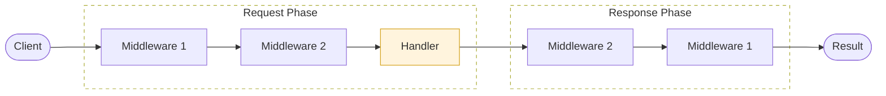

# Middleware

Middleware in SwiftJS follows the classic "onion model" where requests pass through a stack of functions before reaching your handler, and responses pass back through them on the way out.

## Middleware Function

A middleware is a simple async function that takes the context and a `next` function.

```typescript
import type { Context, Middleware } from 'swiftjs-core';

const myMiddleware: Middleware = async (ctx, next) => {
  // Pre-handler logic
  console.log('Before request');
  ctx.state.set('start', Date.now());

  await next(); // Proceed to next middleware/handler

  // Post-handler logic
  const duration = Date.now() - (ctx.state.get('start') as number);
  console.log(`Request took ${duration}ms`);
};
```

## Synchronous Middleware (Performance Tip)

For maximum performance, you can write synchronous middleware. If your middleware doesn't need to `await` anything (like simple header checks or logging), simply declare it as a synchronous function.

```typescript
const syncMiddleware: Middleware = (ctx, next) => {
  ctx.res.setHeader('X-Checked', 'true');
  next(); // Returns void if next handler is sync
};
```

This prevents Promise allocation and keeps execution on the main stack.

## Global Middleware

Global middleware runs on every request.

```typescript
app.use(myMiddleware);
app.register(devToolsPlugin({ logging: true }));
```

## Route Middleware

You can also apply middleware to specific routes.

```typescript
app.get(
  '/protected',
  ctx => {
    return { secret: 'data' };
  },
  {
    middleware: [authMiddleware],
  }
);
```

### In File-based Routing

```typescript
// src/routes/admin/dashboard.get.ts
export const config = {
  middleware: [authMiddleware, adminOnlyMiddleware],
};

export default function handler(ctx) {
  // ...
}
```

## Built-in Middleware

SwiftJS Core comes with essential middleware.

### Dev Tools

Provides detailed request logging, timing headers, and request IDs during development.

```typescript
import { devToolsPlugin } from 'swiftjs-core';

app.register(
  devToolsPlugin({
    logging: true, // Pretty terminal logs
    timing: true, // Server-Timing headers
    requestId: true, // X-Request-Id header
  })
);
```

## Official Middleware Plugins

Install these separate packages for common needs.

### CORS

Handle Cross-Origin Resource Sharing.

```typescript
import cors from 'swiftjs-cors';

app.use(
  cors({
    origin: '*',
    methods: ['GET', 'POST'],
  })
);
```

### Helmet

Secure HTTP headers.

```typescript
import helmet from 'swiftjs-helmet';

app.use(helmet());
```

### Rate Limit

Simple in-memory rate limiting.

```typescript
import { rateLimit } from 'swiftjs-ratelimit';

app.use(
  rateLimit({
    windowMs: 15 * 60 * 1000, // 15 minutes
    max: 100, // limit each IP to 100 requests per windowMs
  })
);
```

## Execution Model: The Onion

SwiftJS middleware follows the "Onion Model," where each middleware has the opportunity to perform logic before the next handler (Request Phase) and after it returns (Response Phase).



## Internal Mechanics: The Iterative Runner

Unlike traditional frameworks (like Koa) that use recursive `next()` calls—which can lead to `Maximum call stack size exceeded` errors in deep chains—SwiftJS uses a **High-Performance Iterative Runner**.

### Why it matters:
- **Loop vs Recursion**: We execute the chain in a flattened loop. This reduces the pressure on the JavaScript call stack.
- **State Management**: The context state and stack data are preserved in a pre-allocated array, optimized for cache locality.
- **Bailout Optimization**: If a middleware chooses not to call `next()`, the runner immediately breaks the loop and begins the response phase, saving unnecessary cycles.


## Middleware Execution Order

The execution flow is strictly deterministic:

1. **Global Scoped Mids**: Executed in the exact order they were registered via `app.use()`.
2. **Plugin Scoped Mids**: Registered via `app.register()` as part of plugin initialization.
3. **Route Scoped Mids**: Defined in your route config.
4. **Target Handler**: Your final controller logic.

> [!IMPORTANT]
> Because SwiftJS supports **Hybrid Execution**, if all middlewares in the chain are synchronous, the entire runner stays on the sync path. Adding even one `async` middleware will move the remainder of the chain to the microtask queue.

