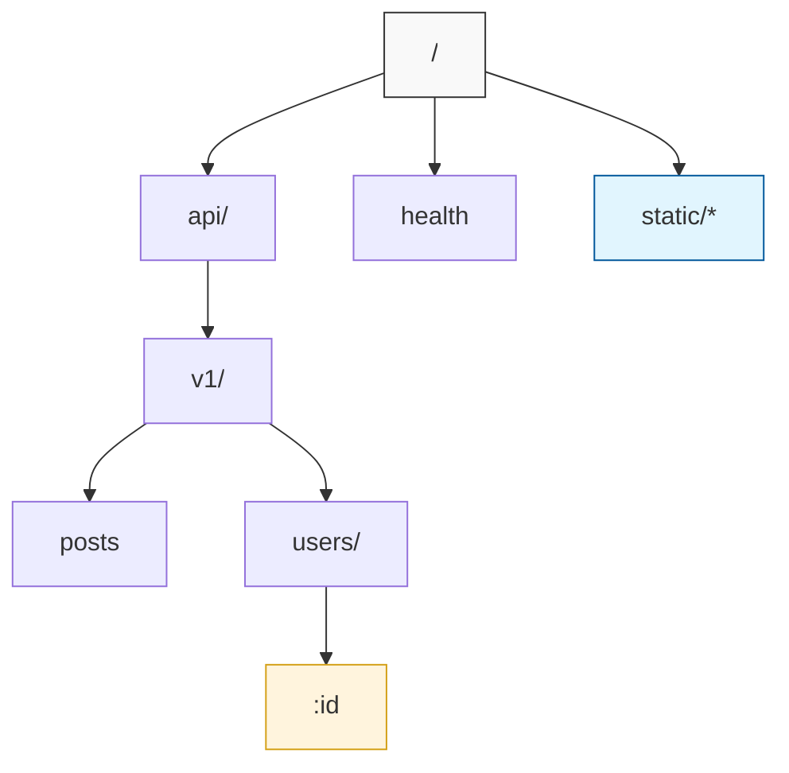

# Routing

SwiftJS offers a flexible routing system that supports both **File-based Routing** (recommended) and **Code-based Routing**. Both methods utilize the high-performance Radix Router under the hood.

## File-based Routing

SwiftJS embraces a Next.js-inspired file-based routing system. Routes are automatically generated based on your file structure in the `src/routes` directory.

### Conventions

- **Files:** Files ending in `.[method].ts` become routes.
  - `index.get.ts` → `GET /`
  - `users.post.ts` → `POST /users`
- **Directories:** Directories create URL path segments.
  - `api/users.get.ts` → `GET /api/users`
- **Dynamic Params:** Files or directories in `[]` create dynamic parameters.
  - `users/[id].get.ts` → `GET /users/:id`
  - `posts/[slug]/comments.get.ts` → `GET /posts/:slug/comments`

### Example Structure

```
src/routes/
├── index.get.ts           # GET /
├── health.get.ts          # GET /health
├── users/
│   ├── index.get.ts       # GET /users
│   ├── index.post.ts      # POST /users
│   └── [id].get.ts        # GET /users/:id
└── api/
    └── v1/
        └── posts.get.ts   # GET /api/v1/posts
```

### Route Handlers

A route file exports a default handler function and optional configuration.

```typescript
// src/routes/users/[id].get.ts
import type { Context } from 'swiftjs-core';
import { z } from 'swiftjs-core';

// Default export is the handler
export default function handler(ctx: Context) {
  const { id } = ctx.params;
  return ctx.json({ id, name: 'User ' + id });
}

// Optional validation schema
export const params = z.object({
  id: z.coerce.number(), // Automatically converts string to number
});

// Optional route configuration
export const config = {
  middleware: [authMiddleware],
};

// Documentation
export const summary = 'Get user by ID';
export const tags = ['Users'];
```

## Code-based Routing

For simple apps or specific use cases, you can define routes programmatically.

```typescript
import { createApp } from 'swiftjs-core';

const app = createApp();

app.get('/users', ctx => {
  return { users: [] };
});

app.post('/users', ctx => {
  const body = ctx.body;
  // ...
});

// Route grouping
app.group('/api/v1', api => {
  api.get('/status', () => ({ status: 'ok' }));

  api.group('/users', users => {
    users.get('/', () => []);
    users.get('/:id', ctx => ctx.params.id);
  });
});
```

## Route Constraints

Constraints allow you to restrict routes based on runtime conditions like hostname, API version, or custom headers.

```typescript
import { createApp, versionConstraint, hostConstraint } from 'swiftjs-core';

const app = createApp();

// Version-based routing
app.get('/users', handler, {
  constraints: versionConstraint('v1', 'v2')
});

// Hostname-based routing
app.get('/admin', adminHandler, {
  constraints: hostConstraint('admin.example.com')
});

// Custom constraints
app.get('/beta-feature', betaHandler, {
  constraints: {
    custom: async (ctx) => ctx.headers['x-beta-user'] === 'true'
  }
});
```

### Version Extraction logic

SwiftJS automatically extracts versions from:
1. **Headers**: `Accept-Version` or `X-API-Version`.
2. **Path**: Leading segments like `/v1/users`.
3. **Query**: `?version=v1`.

## The Radix Engine

At the heart of SwiftJS's routing is a high-performance **Radix Tree (Patricia Tree)**. This structure allows for exceptionally fast route matching with predictable performance, regardless of the number of registered routes.

### Visualizing the Radix Tree



### Matching Precedence

SwiftJS follows a strict precedence model to resolve route conflicts:
1. **Static Routes**: Exact string matches (e.g., `/api/v1/posts`) are matched first via a pre-calculated index.
2. **Parametric Routes**: Dynamic segments (e.g., `/users/:id`) are matched if no static route exists.
3. **Wildcard Routes**: Catch-all segments (e.g., `/*path`) have the lowest priority.

## Performance Architecture

SwiftJS doesn't just match routes; it optimizes the entire execution path.

### 1. Zero-Allocation Matching
During the matching process, the router does not allocate new objects. Instead:
- It uses a specialized pointer-based system to scan the URI.
- Route parameters are sliced directly into the `HttpContext` parametric buffer.
- This results in zero garbage collection pressure on the "hot path".

### 2. Parametric Optimization Buckets
The Radix Tree nodes are bucketed by their segment type. When the engine encounters a dynamic segment, it uses an optimized lookup table to jump to the correct sub-node, avoiding costly string comparisons.

### 3. Hybrid Sync/Async Dispatch
One of the most powerful features of SwiftJS is its **Hybrid Dispatcher**.
- **Sync Path**: If your handler and all associated middlewares are synchronous, the framework executes them in a single contiguous block on the call stack. This eliminates the overhead of `Promise` creation and microtask scheduling.
- **Async Path**: If any part of the chain is `async`, the runner seamlessly transitions to an asynchronous execution model.

> [!TIP]
> **Performance Tip**: Whenever possible, use synchronous middlewares and handlers for "hot" heartbeat or health-check routes to maximize throughput.


## Route Parameters

Access route parameters via `ctx.params`.

```typescript
app.get('/users/:id/posts/:postId', ctx => {
  const { id, postId } = ctx.params;
  // ...
});
```

## Query Parameters

Access parsed query string parameters via `ctx.query`.

```typescript
// GET /search?q=swiftjs&limit=10
app.get('/search', ctx => {
  const { q, limit } = ctx.query;
  // q = 'swiftjs', limit = '10' (string)
});
```
