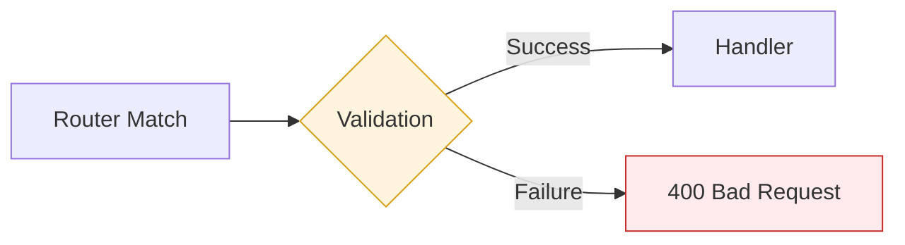

# Schema Validation

SwiftJS features deeply integrated, first-class support for **Zod**. Unlike other frameworks that treat validation as an afterthought, SwiftJS treats it as a core part of the request lifecycle, optimized for maximum throughput.

## The Validation Pipeline

Validation in SwiftJS occurs highly efficiently after routing but before your handler or middlewares are even invoked.



## Internal Optimizations

1. **Schema JIT-ing**: The framework performs a one-time "pre-compilation" of your Zod schemas during route registration. This optimizes the validation hot-path for sub-millisecond execution.
2. **Zero-Inference Overhead**: Type inference is handled entirely at compile-time via TypeScript. There is zero runtime performance cost for the end-to-end type safety provided.
3. **Coercion Engine**: Built-in support for `z.coerce` allows the engine to smartly convert string-based query/params into native types (Numbers, Booleans) without manual casting.


## Validation Scopes

You can validate three parts of the request:

1. **Body:** `ctx.body`
2. **Query:** `ctx.query`
3. **Params:** `ctx.params`

```typescript
app.get(
  '/search/:category',
  ctx => {
    const { category } = ctx.params; // string
    const { q, limit } = ctx.query; // string, number
    return { category, q, limit };
  },
  {
    params: z.object({
      category: z.enum(['books', 'movies']),
    }),
    query: z.object({
      q: z.string().min(1),
      limit: z.coerce.number().min(1).max(100).default(20),
    }),
  }
);
```

> **Note:** Use `z.coerce` for query and params since they are originally strings in the URL.

## File-based Routing

In file-based routing, you export the schemas separately.

```typescript
// src/routes/users.post.ts
import { z, Context } from 'swiftjs-core';

export default function handler(ctx: Context) {
  const { name, email } = ctx.body; // Typed automatically in handler
  return { id: 1, name, email };
}

// Export specific schemas
export const body = z.object({
  name: z.string().min(2),
  email: z.string().email(),
});

export const query = z.object({
  referral: z.string().optional(),
});
```

## Error Handling

When validation fails, SwiftJS automatically returns a `400 Bad Request` response with details about the errors.

```json
{
  "error": "Validation Error",
  "message": "Validation failed",
  "details": [
    {
      "code": "invalid_string",
      "validation": "email",
      "message": "Invalid email",
      "path": ["email"]
    }
  ]
}
```

You can customize this behavior using the `onError` hook if needed.

## Type Inference

The `Context` object in your handler will automatically infer the types from your validation schemas when using the `config` object or file exports.

For manual typing (e.g., in separate functions):

```typescript
import { z } from 'swiftjs-core';

const UserSchema = z.object({
  name: z.string(),
  age: z.number(),
});

type User = z.infer<typeof UserSchema>;
```
